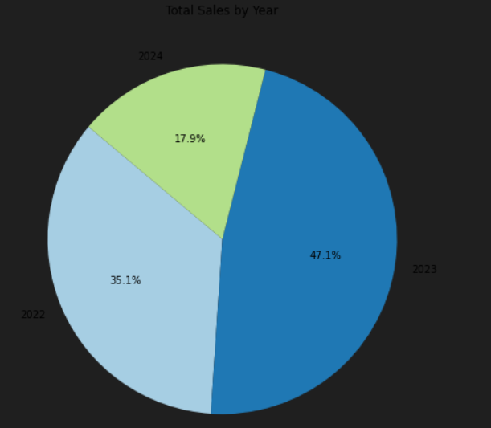
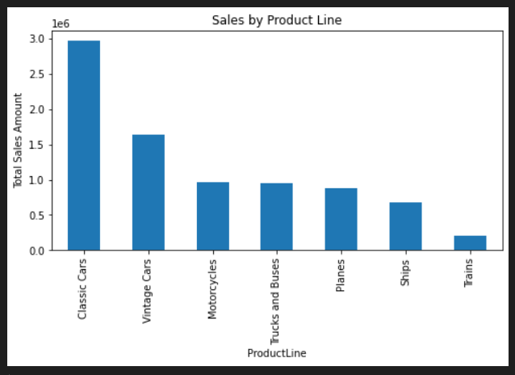
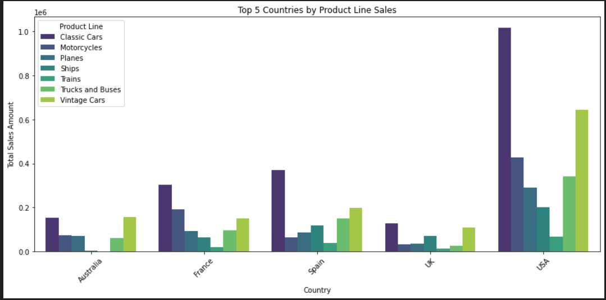
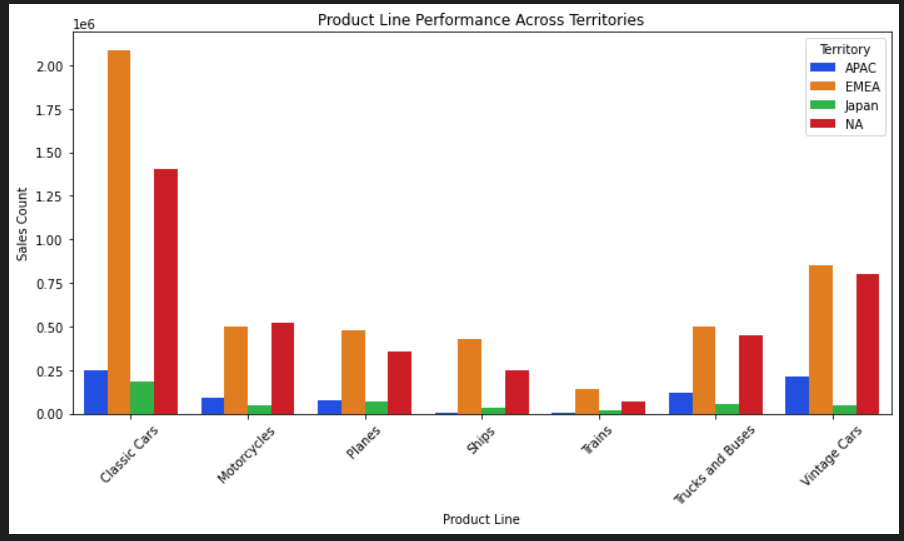
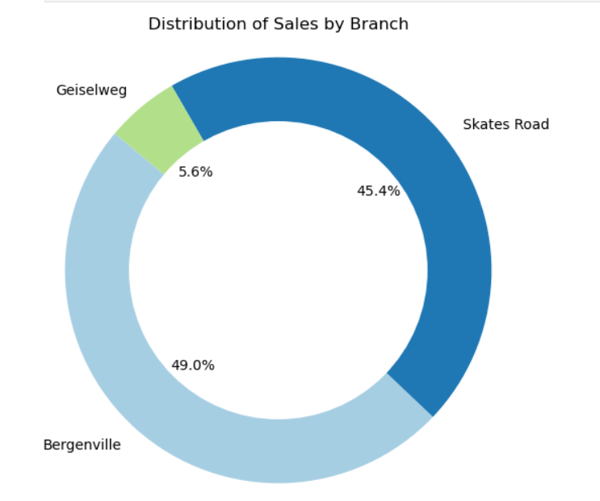
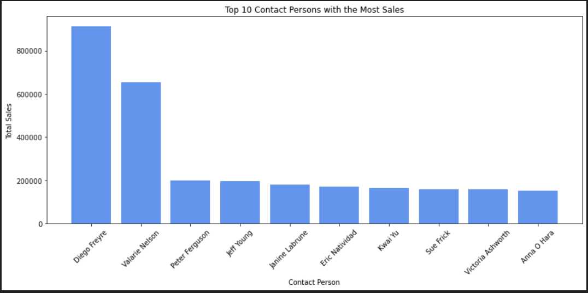
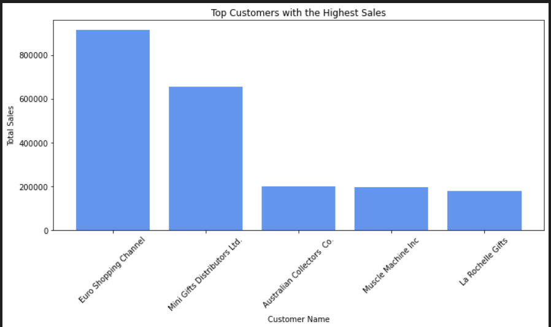

# Sales Analytics Dashboard

## Business Understanding

The purpose of this project is to develop an interactive and insightful sales dashboard using Power BI. The dashboard aims to provide stakeholders with a comprehensive view of key sales metrics, trends, and performance indicators across various dimensions, such as time, territory, product line, and customer demographics.

### Objectives

- To enable data-driven decision-making by visualizing critical sales data.
- To identify trends and highlight growth opportunities by analyzing sales distribution, customer purchasing patterns, and product performance.
- To support sales strategies by pinpointing high-performing territories and products, aiding in resource allocation and targeting efforts.

The `dashboard` will cater to:

1. Sales Teams - for monitoring targets and identifying high-potential customers and regions.
2. Marketing and Strategy Departments - to tailor marketing campaigns based on regional sales data and popular products.
3. Executive Management - for high-level insights into the organization’s sales performance.

## Data Understanding

The dataset includes three main files:

- Main Data: Records of individual sales transactions, capturing order details, product specifics, customer info, and branch locations.
- Product Master: Details about each product, allowing analysis by product line, category, or specifications.
- Data Dictionary: Definitions and descriptions of each field across the datasets.

### Key Columns in Main Data

**Order Details**:

`OrderNumber, QuantityOrdered, PriceEach, OrderLineNumber, Sales, Status`

- These columns capture details of each transaction, including quantities, pricing, and total sales amounts.

**Temporal Information**:

`QTR_ID, DAY_ID, MONTH_ID, YEAR_ID`

- These columns were combined into a single Date column for easier time-based analysis.

**Product Information**:

`ProductCode`

- Used to link sales transactions to product details in the Product Master dataset.

**Customer Information**:

`CustomerName, Phone, AddressLine1, City, PostalCode, Country, ContactName`

- Captures details about each customer and their location.

**Branch Information**:

`Branch, Territory`

- Provides data on the branch responsible for each sale and the territory it serves.

The `Main Data` has 22 columns, with missing values in two fields:

## Data Preparation

### Handling missing values

- Postal Code: 76 missing values, filled with 0 as a placeholder for unknown postal codes.
- Territory: 1,074 missing values, filled based on country:
  - we assigned USA and Canada entries with missing Territory with "NA" (North America).

- To clean the data dictionary, we identified and removed unnecessary columns, specifically those labeled as `Unnamed: 0`, `Unnamed: 1`, and `Unnamed: 2`. These columns may have been created during data import and are not needed for analysis.

### Combine contact names

We merged the columns `ContactFirstName` and `ContactLastName` into a single column, `ContactName`, to simplify customer information. After combining the name fields, we dropped the original `ContactFirstName` and `ContactLastName` columns from the dataset.

### Combine Date Columns

We merged the columns `YEAR_ID`, `MONTH_ID`, and `DAY_ID` to create a single `Date` column in *YYYY-MM-DD* format. After creating the Date column, we dropped the original `DAY_ID`, `MONTH_ID`, and `YEAR_ID` columns from the dataset.

### Merging data

To provide additional product information in the analysis, we merged the Main Data with the Product Master dataset using an inner join on ProductCode. This enriched the dataset with product-specific details and created a comprehensive dataset `sales` for analysis and dashboarding.

### Data Transformation

- Calculate Total Costs:

  - To gain insight into the profitability of sales, we calculated the `TotalCosts` by multiplying the `QuantityOrdered` by the `CostPrice` for each sale. This new column provides a clearer picture of the cost incurred for each order.

- Calculate Total Sales Amount:

  - Similarly, we calculated the `TotalSalesAmount` by multiplying the `QuantityOrdered` by the `PriceEach` for each sale. This new column reflects the total revenue generated from each order.

- Calculate Profit:

  - We determined the `Profit` for each sale by subtracting `TotalCosts` from `TotalSalesAmount`. This calculation gives a clear understanding of the earnings from each sale.

- Calculate Profit Margin:

  - We calculated the `ProfitMargin` as a percentage of `Profit over TotalCosts`, which provides insights into the efficiency of sales.

- Calculate Total Discounted Amount:

  - Finally, we calculated the `TotalDiscounted` amount as the difference between the suggested retail price `(MSRP)` multiplied by the `QuantityOrdered` and the `TotalSalesAmoun`t. This helps in understanding the total discounts given.

These calculations enable a comprehensive analysis of sales performance by providing insights into profit, profit margins, and discounts, which can guide pricing strategies and financial decision-making.

## Exploratory Data Analysis

- **Sales by Year Analysis**:

To understand yearly sales distribution, we calculated the total Sales for each year by grouping the data by `YEAR_ID` and summing the Sales values.

- The pie chart revealed the following sales distribution:

  - 2022: 35.1%
  - 2023: 47.1%
  - 2024: 17.9%

This incourages us to develop intuitive insights that will help in improving the sales of toys this year (2024).

- **Sales by Product Line Analysis**:

To evaluate the performance of different product lines, we calculated the total sales amount for each product line by grouping the data by ProductLine and summing the TotalSalesAmount.

This bar chart provides a clear visual representation of sales performance across different product lines, allowing us to identify which lines contribute the most to total sales. This shows that classic cars contribute to most sales.

- **Top 5 Countries by Product Line Sales**:

To analyze sales performance across countries, we calculated the total sales amount for each product line within each country. We then identified the top five countries based on total sales.

This visualization allows for a comparative analysis of product line sales across the top-performing countries, providing insights into market trends and consumer preferences.

- **Product Line Performance Across Territories**:

To assess how different product lines perform across various territories, we calculated the total sales for each product line within each territory.

This visualization provides valuable insights into how each product line is received in different territories, enabling better-targeted marketing and sales strategies.

- **Distribution of Sales by Branch**:

To analyze the sales distribution across different branches, we calculated the value counts of the Branch column.

This donut chart effectively highlights the proportion of sales attributed to each branch, enabling a better understanding of branch performance and helping identify areas for potential growth.

- **Top 10 Contact Persons with the Most Sales**:

To identify the contact persons contributing the most to sales, we aggregated the total sales by ContactName.

This bar chart effectively highlights the contact persons who are driving the most sales, allowing for targeted recognition and potential strategies to further enhance their performance.

- **Top Customers with the Highest Sales:**:

To identify the customers contributing the most to total sales, we aggregated the sales by CustomerName.

This bar chart provides a clear view of the customers generating the most sales, enabling businesses to focus on key accounts for retention strategies and targeted marketing efforts.

- **Quarterly Sales Trends**:

  To identify and get insights on how sales performed across the yearly quarters in the three years.

  

  The line graph provides a clear visual of how sales were made in the different quarters , this help businesses identify during which periods have high sales and which
  periods have low sales.

